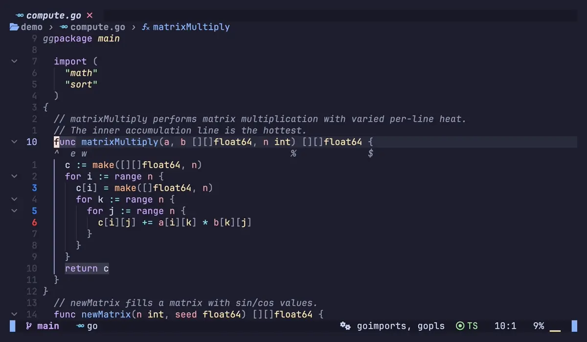
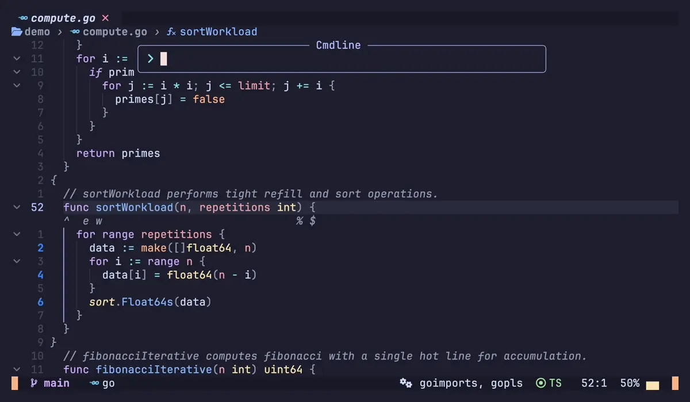
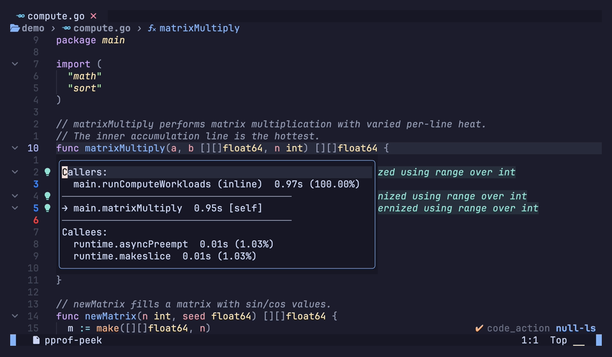

# nvim-pprof

> Go pprof profiler integration for Neovim

[](https://github.com/nvim-contrib/nvim-pprof/actions/workflows/test.yml)
[](https://github.com/nvim-contrib/nvim-pprof/releases)
[](LICENSE)
[](https://neovim.io)

## Features

- Load and parse Go pprof profiles (CPU, memory, allocations)
- Heat-gradient signs in the sign column and line numbers showing hot/cold lines
- Inline virtual text hints showing flat/cum values per line
- Floating top-N function summary with profile type label, sparkline bar, and pass/fail threshold coloring
- Peek window showing callers/callees for any function
- Location list populated with all profiled hotspot lines
- File watcher for auto-reload when profiles change on disk



## Requirements

- Neovim >= 0.11
- Go toolchain (`go tool pprof`)

## Installation

### lazy.nvim

```lua
{
  "nvim-contrib/nvim-pprof",
  opts = {},
}
```

### packer.nvim

```lua
use({
  "nvim-contrib/nvim-pprof",
  config = function()
    require("pprof").setup()
  end,
})
```

## Generating profile files

The plugin reads a pre-generated pprof profile — it does not run tests itself.

By default the plugin searches for profile files in the current working
directory using the patterns `cpu.prof`, `mem.prof`, `*.prof`, `*.pprof`.
Override with the `file` option if your tool writes elsewhere.

| Profile type | Command | Default file |
| ------------ | ------- | ------------ |
| CPU (tests)  | `go test -cpuprofile cpu.prof -bench .` | `cpu.prof` |
| Memory (tests) | `go test -memprofile mem.prof -bench .` | `mem.prof` |
| Block / mutex | `go test -blockprofile block.prof` | `block.prof` |
| CPU (live app) | `go tool pprof http://localhost:6060/debug/pprof/profile` | *(pass path directly)* |

## Configuration

```lua
require("pprof").setup({
  -- binary used to invoke pprof; defaults to "go" (runs `go tool pprof`)
  -- pprof_bin = "go",

  -- glob patterns searched in cwd when no path is given to :PProfLoad
  -- defaults to: { "cpu.prof", "mem.prof", "*.prof", "*.pprof" }
  -- file = { "cpu.prof", "*.prof" },

  -- register :PProf* commands (default: true)
  commands = true,

  auto_reload = {
    enabled    = false, -- auto-reload profile when .prof file changes on disk
    timeout_ms = 500,   -- debounce delay before reloading
  },

  -- called after a profile is loaded
  on_load = nil,

  signs = {
    cold        = { hl = "PprofHeatCold", text = "▎" }, -- coldest lines
    warm        = { hl = "PprofHeatWarm", text = "▎" }, -- mid-range lines
    hot         = { hl = "PprofHeatHot",  text = "▎" }, -- hottest lines
    group       = "pprof",  -- sign group name (:h sign-group)
    signhl      = false,    -- show glyph in sign column (toggleable at runtime)
    numhl       = true,     -- color the line number (toggleable at runtime)
    linehl      = false,    -- color the entire line background (toggleable at runtime)
    heat_levels = 5,        -- number of gradient steps between cold and hot
  },

  highlights = {
    cold = { fg = "#3b82f6", bg = "#1e3a5f" },
    warm = { fg = "#f59e0b", bg = "#7a4f05" },
    hot  = { fg = "#ef4444", bg = "#7f1d1d" },
  },

  line_hints = {
    enabled   = false,                     -- show hints automatically after load
    format    = "{flat} flat | {cum} cum", -- {flat} and {cum} are substituted
    position  = "eol",                     -- "eol" | "right_align" | "inline"
    highlight = { link = "Comment" },
  },

  top = {
    default_count = 20,
    border        = "rounded",
    width         = 0.70,  -- fraction of editor columns
    height        = 0.50,  -- fraction of editor lines
    min_flat_pct  = 5.0,   -- threshold: flat% >= this gets `fail` colour; 0 disables
    window        = {},    -- extra options passed to nvim_open_win
    highlights = {
      header        = { link = "Title" },
      column_header = { link = "Comment" },
      border        = { link = "FloatBorder" },
      normal        = { link = "NormalFloat" },
      cursor_line   = { link = "CursorLine" },
      pass          = { link = "Comment" },        -- flat% below threshold
      fail          = { link = "DiagnosticWarn" },  -- flat% at or above threshold
    },
  },

  peek = {
    border  = "rounded",
    width   = 0,  -- 0 = auto-size to content; fraction > 0 = fixed ratio
    height  = 0,
    window  = {},
    highlights = {
      header      = { link = "Title" },
      border      = { link = "FloatBorder" },
      normal      = { link = "NormalFloat" },
      cursor_line = { link = "CursorLine" },
    },
  },
})
```

## Usage

### Commands

| Command                | Description                                                                                          |
| ---------------------- | ---------------------------------------------------------------------------------------------------- |
| `:PProfLoad[!] [file]` | Load a profile file. No argument auto-finds in cwd. `!` always shows a picker                       |
| `:PProfSigns [action]` | Show/hide/toggle heat signs. Default: `toggle`                                                       |
| `:PProfHints [action]` | Show/hide/toggle inline hints. Default: `toggle`                                                     |
| `:PProfTop [count]`    | Show top-N functions in a floating window                                                            |
| `:PProfPeek [func]`    | Show callers/callees. No argument uses treesitter to detect the function at cursor                   |
| `:PProfQuickfix`       | Populate quickfix list with one entry per profiled file                                              |
| `:PProfLoclist`        | Populate location list with hotspot lines                                                            |
| `:PProfServerStart [port]` | Auto-load profile (or reuse cached), start pprof web server, open browser when `browser.open` is true (default port: 8080) |
| `:PProfServerStop`     | Stop the pprof web server                                                                            |
| `:PProfClear`          | Clear all profile data, signs, hints, and floats                                                     |



### Lua API

```lua
local pprof = require("pprof")

-- load
pprof.load()                          -- auto-find in cwd using config.file patterns
pprof.load("path/to/cpu.prof")        -- load from explicit path
pprof.load(nil, true)                 -- force picker

-- signs (all channels)
pprof.show_line_signs()
pprof.hide_line_signs()
pprof.toggle_line_signs()

-- sign column glyph / line number / full-line background (runtime toggles)
pprof.show_signhl()   pprof.hide_signhl()   pprof.toggle_signhl()
pprof.show_numhl()    pprof.hide_numhl()    pprof.toggle_numhl()
pprof.show_linehl()   pprof.hide_linehl()   pprof.toggle_linehl()

-- inline hints
pprof.show_line_hints()
pprof.hide_line_hints()
pprof.toggle_line_hints()

-- floating windows
pprof.top(count)
pprof.peek(func_name)

-- quickfix / loclist navigation
pprof.quickfix()
pprof.loclist()

-- jump to next/previous hotspot sign
pprof.jump_next()
pprof.jump_prev()

-- pprof web server
pprof.start_server()         -- start at default port; opens browser when browser.open = true
pprof.start_server(9090)     -- start at custom port
pprof.stop_server()          -- stop the server

-- clear
pprof.clear()
```

### Top window keys

| Key         | Action                                   |
| ----------- | ---------------------------------------- |
| `sf`        | Sort by flat                             |
| `sc`        | Sort by cum                              |
| `Enter`     | Jump to source for function under cursor |
| `q` / `Esc` | Close                                    |

The window title shows the detected profile type (e.g. `[cpu]`, `[heap]`).
Each row includes a 10-character sparkline bar (█░) normalised to the hottest
entry, and the flat% column is coloured pass/fail against `top.min_flat_pct`.


### Quickfix / loclist workflow

```
:PProfQuickfix   → quickfix list of profiled files, hottest first
:PProfLoclist    → location list of hotspot lines in current file
```

Navigate the quickfix list with `:cnext` / `:cprev` (or `]q` / `[q` with a mapping).
Navigate the location list with `:lnext` / `:lprev`.

### Peek keybinding

`:PProfPeek` detects the function name under the cursor via treesitter, so
you can map it directly:

```lua
vim.keymap.set("n", "<leader>pp", "<cmd>PProfPeek<CR>",
  { desc = "pprof: peek callers/callees" })
```



### neotest integration

The plugin ships built-in neotest consumers so the profile reloads automatically after every test run.

**Generic consumer** — works for any setup where the profile file is written to a known location in cwd:

```lua
require("neotest").setup({
  consumers = {
    pprof = require("pprof.neotest"),
  },
})
```

**Go consumer** — searches the neotest output directories for profile files first, then falls back to cwd. Configure neotest-go to emit a profile:

```lua
require("neotest").setup({
  adapters = {
    require("neotest-go")({
      args = { "-cpuprofile", "cpu.prof" },
    }),
  },
  consumers = {
    pprof = require("pprof.neotest.go"),
  },
})
```

Both consumers can be combined:

```lua
require("neotest").setup({
  consumers = {
    pprof    = require("pprof.neotest"),
    pprof_go = require("pprof.neotest.go"),
  },
})
```

## Contributing

Contributions are welcome. Please open an issue or pull request on
[GitHub](https://github.com/nvim-contrib/nvim-pprof).

## License

[MIT](LICENSE)
